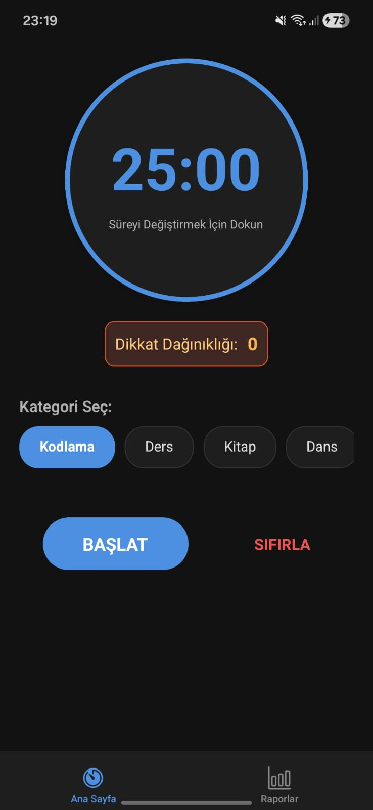
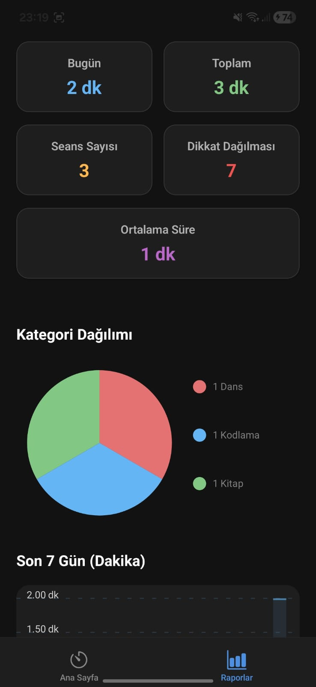

# OdakTakip (Odaklanma Takibi ve Raporlama Uygulaması)

Bu proje, Sakarya Üniversitesi Bilgisayar Mühendisliği Bölümü **BSM 447 - Mobil Uygulama Geliştirme** dersi dönem ödevi kapsamında geliştirilmiştir.

## Projenin Amacı
Kullanıcının belirlediği süre boyunca telefondan uzak durmasını sağlar, uygulamadan çıkışları (dikkat dağınıklığını) tespit eder ve bu odaklanma seansları hakkında detaylı raporlar sunar.

##  Özellikler

### 1. Odaklanma Yönetimi
* **Ayarlanabilir Sayaç:** Kullanıcı (+) ve (-) butonlarıyla istediği dakikayı ayarlayabilir.
* **Kategori Sistemi:** Varsayılan kategorilerin yanı sıra, kullanıcı **kendi özel kategorisini** ekleyebilir.

### 2. Uygulama Durum Yönetimi
* **Dikkat Dağınıklığı Algılama:** Kullanıcı odaklanma sırasındayken uygulamayı arka plana atarsa (Farklı bir uygulamaya geçmek, ana ekrana dönmek vb.), uygulama bunu anında tespit eder. Dikkat dağınıklığı durumunda sayaç durur. Dikkat dağınıklıklarının sayısı raporlara işlenir.

### 3. Veri Kaydı ve Raporlama
* **Kalıcı Hafıza:** Tamamlanan tüm seanslar ve kullanıcının eklediği özel kategoriler telefon hafızasında saklanır. Uygulama kapatılıp açılsa bile veriler kaybolmaz.
* **Grafiksel Analiz:**
    * Hangi kategoride ne kadar çalışıldığını gösterir.
    *  Son 7 günün çalışma performansını dakika bazında gösterir.
    *  Toplam süre, günlük süre, seans sayısı ve ortalama odaklanma süresi gibi metrikler sunulur.

## Kullanılan Teknolojiler ve Kütüphaneler

Proje **React Native (Expo)** altyapısı ile geliştirilmiştir.

| Modül | Amaç |
|-----------|------|
| **React Native** | Ana geliştirme iskeleti |
| **React Navigation** | Sayfalar arası geçiş ve Alt Menü (Bottom Tabs) yönetimi |
| **AsyncStorage** | Verilerin yerel cihazda kalıcı olarak saklanması |
| **AppState** | Uygulamanın arka plana atılıp atılmadığının takibi |
| **React Native Chart Kit** | Rapor ekranındaki grafiklerin çizilmesi |
| **Expo Vector Icons** | Uygulama içi ikonlar |

## Proje Yapısı

```text
src/
├── components/          # Yeniden kullanılabilir UI parçaları
│   ├── AddCategoryModal.js  # Kategori ekleme penceresi
│   ├── CategorySelector.js  # Kategori listesi ve seçim mantığı
│   ├── ChartsSection.js     # Grafiklerin çizildiği alan
│   ├── ControlButtons.js    # Başlat/Durdur/Sıfırla butonları
│   ├── DistractionBadge.js  # İhlal sayacı göstergesi
│   ├── StatCard.js          # Rapor ekranındaki bilgi kartları
│   ├── TimePickerModal.js   # Süre ayarlama penceresi
│   └── TimerDisplay.js      # Ana sayaç görünümü
├── screens/             # Ana ekranlar
│   ├── HomeScreen.js        # Odaklanma ve sayaç ekranı
│   └── ReportScreen.js      # İstatistik ve grafik ekranı
└── App.js               # Navigasyon ve Tema ayarları
```

## Kurulum ve Çalıştırma

1.  **Projeyi Klonlayın:**
    ```bash
    git clone https://github.com/ozgrakby/OdakTakip.git
    cd OdakTakip
    ```

2.  **Bağımlılıkları Yükleyin:**
    ```bash
    npm install
    ```

3.  **Uygulamayı Başlatın:**
    ```bash
    npx expo start -c
    ```
    *Not: `-c` parametresi önbelleği temizleyerek başlatır, olası hataları önler.*

4.  **Test Edin:**
    * Expo Go uygulaması ile QR kodu okutarak telefonunuzda test edebilirsiniz.
    * Android Emulator veya iOS Simulator üzerinde çalıştırabilirsiniz.

## Ekran Görüntüleri
<p align="center">
  
  &nbsp; &nbsp; &nbsp; &nbsp; &nbsp; &nbsp; &nbsp; &nbsp; &nbsp; &nbsp; &nbsp; &nbsp; &nbsp; &nbsp; &nbsp; &nbsp;
   
</p>

## Hazırlayan

* **Ad Soyad:** Özgür Akbay
* **Öğrenci No:** G221210005
* **Ders:** BSM 447 - Mobil Uygulama Geliştirme